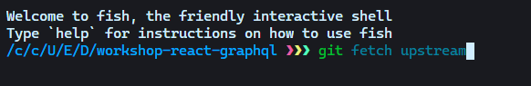
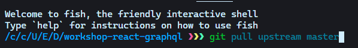

# Guía de configuración 🧰

> Esta guía nos ayudará a tener nuestro ambiente de desarrollo listo para todo el tutorial.

## Administrador de paquetes

Comunmente el administrador de paquetes más utilizado es `npm` sin embargo tenemos ciertas limitaciones en cuanto a escritura y seguridad, por esa razón utilizaremos `yarn` para manejar los paquetes de node y todas la dependecias necesarias en nuestros proyectos.

Como un bonus vamos a aprender a utilizar la caracteristica que tiene `yarn` que es llamada _yarn workspaces_ que nos va a ser de utilidad en este caso para tener varios proyectos de ejemplo con un solo `yarn.lock` que manejará todas las dependencias y podremos compartir paquetes entre proyectos reduciendo así el tiempo de trabajo🐱‍🏍.

Para instalar yarn, recomiendo [Visitar su sitio web](https://yarnpkg.com/getting-started/install)

O podemos usar el siguente comando en nuestra terminal:

```bash
    npm install -g yarn
```

Más sencillo 🧐

## IDE/Editor de texto

Yo en lo personal uso [VSCode](https://code.visualstudio.com/) aunque no es mandatorio usarlo, lo recomiendo.

Estos son algunas de las extensiones que utilizaremos en el transcurso del tutorial.

- [ ] [ES7 React/Redux/GraphQL/React-Native snippets](https://marketplace.visualstudio.com/items?itemName=dsznajder.es7-react-js-snippets)
- [ ] [ESLint](https://marketplace.visualstudio.com/items?itemName=dbaeumer.vscode-eslint)
- [ ] [GitLens — Git supercharged](https://marketplace.visualstudio.com/items?itemName=eamodio.gitlens)
- [ ] [Reactjs code snippets](https://marketplace.visualstudio.com/items?itemName=xabikos.ReactSnippets)
- [ ] [TypeScript Importer](https://marketplace.visualstudio.com/items?itemName=pmneo.tsimporter)
- [ ] [Visual Studio IntelliCode](https://marketplace.visualstudio.com/items?itemName=VisualStudioExptTeam.vscodeintellicode)
- [ ] [GraphQL](https://marketplace.visualstudio.com/items?itemName=mquandalle.graphql)
- [ ] [GraphQL-Prisma](https://marketplace.visualstudio.com/items?itemName=Prisma.vscode-graphql)

En el transcurso del curso puede que instalemos más extensiones.

## Control de versiones

Recomiendo el uso de git en especifico GitHub para poder ir al día con el proceso del tutorial.

Puedes realizar una copia de este repositorio haciendo un [`fork`](https://docs.github.com/en/github/getting-started-with-github/fork-a-repo) y clonando esa versión en tu computadora usando `git clone <Tu-Fork>`

> Nota: Si quieres mantener tu fork sincronizado con los últimos cambios de este repositorio puedes usar `git upstream` Adjunto un ejemplo de como se mantiene el upstream con tu fork

Para sincronizar o enlazar tu fork con este repo



Esto creará una rama para obtener cambios desde el repositorio original.

Para sincronizar cambios debes hacer un `pull`



> Nota: El upstream sirve para conseguir los últimos cambios de este repositorio, lo más recomendable es que sigas los pasos del tutorial y crees tu propio repositorio. Mira este upstream como una manera de conseguir el código si algo no va bien y necesitas ayuda del código de este repositorio o si crees que necesita un cambio.

## Hosting

Para hosting utilizaremos varios servicios.

### Vercel

Vercel es una plataforma en donde podremos hacer deply de nuestro Frontend, de una manera sencilla y muy profesional, la integración de este servicio con GitHub es muy buena linkea tu cuenta en [Vercel](https://vercel.com/home)

### Digital Ocean

Digital Ocean es una plataforma en donde vamos a poder hacer deploy en la nube, es un servicio muy escalabe y además tenemos $100 de credit durante 60 días para usuarios nuevos, si no tienes cuenta en Digital Ocean puedes crearla [aquí](https://cloud.digitalocean.com/registrations/new)

### Docker

Docker es un sistema de containarización en donde podemos crear un contendor con imagenes de nuestro ambiente de desarrollo, es similar a una máquina virtual pero tiene más ventajas, es más moderno y más veloz para levantar las imagenes.

Nosotros utilizaremos [Docker Hub](https://www.docker.com/) y la extensión de [Docker](https://marketplace.visualstudio.com/items?itemName=ms-azuretools.vscode-docker) en VSCode.

## Base de datos

En esta ocasión puedes utilizar cualquier base de datos que sea compatible con [TypeORM](https://typeorm.io/#/) en este tutorial usaré PostgreSQL que mi base de datos de preferencia, puedes descargar PostgreSQL [aquí](https://www.postgresql.org/download/) la base de datos la usaremos para guardar una representación del inventario de los Pokemon que hemos capturado, no será una base de datos tan robusta pero es para tener una idea.

## Importante

Para construir nuestro server de GraphQL usaremos Node.js específicamente TS Node, así que te recomiendo instalar TypeScript de manera global.

¿Como instalar TS?:

```bash
    npm install -g typescript
```

Es recomendable saber utilizarlo bien ya que vamos a hacer uso de conceptos más avanzados. Puedes consultar su [website](https://www.typescriptlang.org/) para más detalles.

> _TypeScript es el lenguaje de programación que extiende JavaScript agregándole tipos_

## Recursos que nos pueden servir para el camino

- [Documentación oficial de React](https://es.reactjs.org/)
- [TypeORM docs](https://typeorm.io/#/)
- [Documentación de Apollo Server](https://www.apollographql.com/docs/)

[Ir a la siguente lección](https://github.com/rodzy/workshop-react-graphql/tree/master/02_Introducción)

