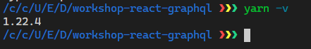
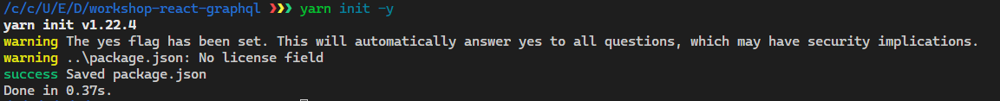
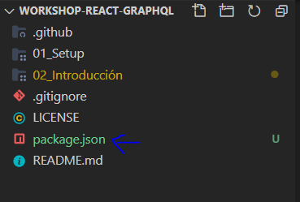

# Introducción

A manera de comenzar el tutorial, aprenderemos sobre Yarn workspaces y cual es su utilidad, también el porqué de utilizarlo en este tipo de proyectos.

## '¿Qué es Yarn?'

> Yarn es un administrador de paquetes moderno dividido en varios paquetes. Su novedosa arquitectura permite hacer cosas actualmente imposibles con las soluciones existentes

<p align="right">

</p>

Puedes consultar su api en: https://yarnpkg.com/api/

## '¿Qué son los Yarn Workspaces?'

> Los workspaces son una nueva forma de configurar la arquitectura de su paquete que está disponible de forma predeterminada a partir de Yarn 1.0. Le permite configurar varios paquetes de tal manera que solo necesita ejecutar yarn install una vez para instalarlos todos en una sola pasada.

Los workspaces son una forma de nosotros poder compartir dependecias entre proyectos con una única instalación y solo un `yarn.lock` esto para que? El uso de esta prática se le conoce como monorepositorio en el que podemos tener muchos proyectos con una sola carpeta de `node_modules` lo que hace más rápida la instalación de dependencias de manera repetida en los proyectos.

## '¿Porqué usarlos?'

Es muy útil utilizarlos en este tipo de repositorio en donde vamos a tener varias copias del proyecto que vamos a ir desarrollando lo cual haría más tedioso tener que estar escribiendo `yarn install` para cada uno de los proyectos.

<p align="center">

</p>

Además, podremos tener nuestro _Server_ y nuestro _Cliente_ en el mismo proyecto sin problemas, impresionante ehh!!! 😵

## Comenzamos

Primeramente debemos verificar que versión de `yarn` tenemos, recordemos que los workspaces están disponibles para la versión 1.0 o superior.

Para verificar debemos correr:

```bash
    yarn -v
```

En nuestro terminal



Podemos ver que yo tengo la versión 1.22.4, está perfecta para empezar a trabajar en crear nuestro workspace.

Una vez verificada la versión debemos inicializar `yarn` en la carpeta que va funcionar como nuestro folder principal.

Para inicializar `yarn` en nuestra carpeta:

```bash
    cd <Folder-Principal>
    yarn init -y
```

Este comando inicializa un `package.json` que va ser nuestro _package.json_ principal desde donde vamos a configurar nuestros workspaces.





Ahora debemos configurar nuestro `package.json` para determinar nuestros workspaces. Los workspaces se configuran en un array en donde se van a definir las rutas de las carpetas que van a ser hidratadas por el `yarn.lock`, como buena práctica se recomienda un workspace llamado `packages/*` en el cual todas las carpetas que estén dentro de `packages` serán hidratadas por el `yarn.lock`.

Nuestro _package.json_ debe quedar de esta manera


- `"private":true`: Significa que nuestro package.json no será publicado en npm, en este caso no tendrá un impacto ya que no vamos a publicar este proyecto en `npm`

- `"workspaces":[]`: En este arreglo pasamos las rutas de los folders que vamos a hidratar por el `yarn.lock`

> Nota: El _package.json_ pudiste haberlo creador como un nuevo archivo en la raíz, sin hacer uso del `yarn init` pero de ambas formas es correcto.

Solo recuerda que debes tener esto en tu _package.json_

```json
    {
        "private": true,
        "workspaces": [
            "packages/*"
        ]
    }
```

Listo ya tenemos nuestro _package.json_ listo ahora debemos comenzar a trabajar en nuestro workspace `La carpeta (packages)`

En la siguiente parte del tutorial empezaremos a estructurar nuestro workspace para trabajar con nuestros proyectos.

[Ir a la siguente lección](https://github.com/rodzy/workshop-react-graphql/tree/master/packages)

## Recursos para reforzar lo aprendido

- [Yarn Workspaces](https://classic.yarnpkg.com/en/docs/workspaces/)
