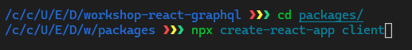
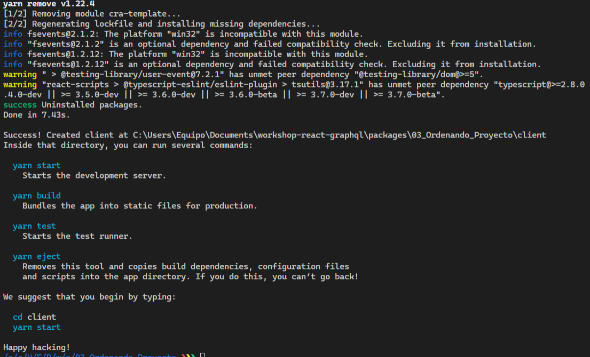
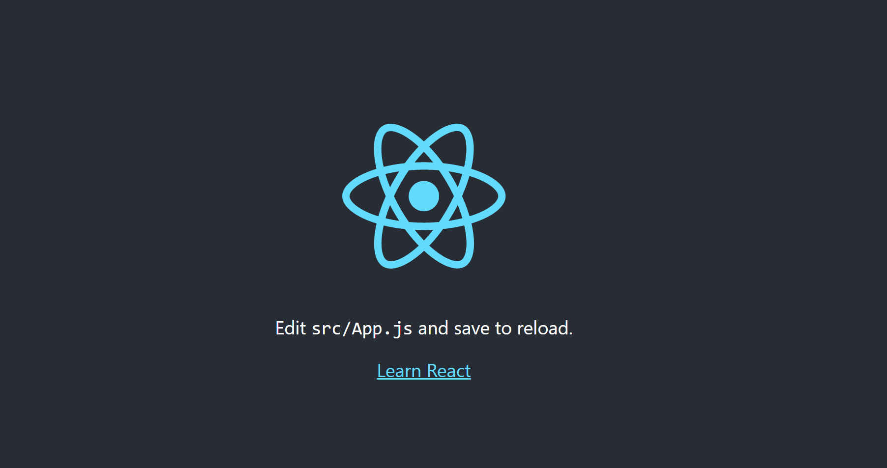
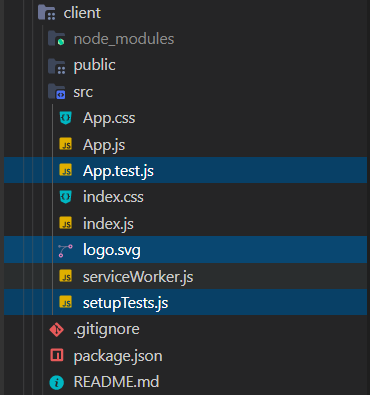
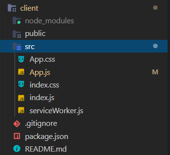
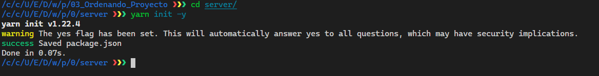
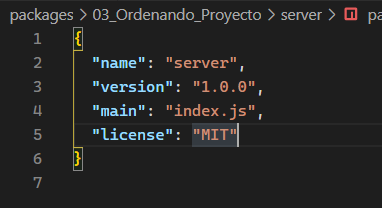
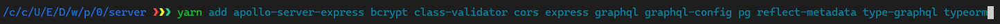
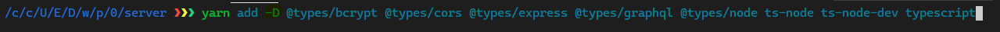

p# Comenzamos estructurando nuestros proyectos

Primeramente debemos pensar en como queremos estructurar nuestros proyectos y que necesitamos para trabajar, podemos tomar como referencia el diagrama de nuestro flujo del proyecto.


Podemos ver que nuestro flujo de aplicación depende de dos bloques.

| Cliente  |    Servidor   |
|----------|:-------------:|
| React.js |  Node         |
| Apollo Client |    GraphQL    |
| PokeAPI | TypeGraphQL   |
| ContextAPI | Apollo Server   |
|  | Express   |
|  | TypeORM  |

Estos dos bloques representan cada uno de los proyectos que tenemos que estructurar dentro de `packages`.

> Nota: La base de datos, la manejaremos de manera independiente ya sea por la consola de `psql` o por la interfaz de `pgAdmin` como te sea más sencillo.

## La carpeta `client`

Esta carpeta es la que va contener todo _Frontend_ de nuestra aplicación, lógica e interfaces de usuario.

Nuestro cliente en esta ocasión será una simple _Single Page Aplication_ de React usando [`create-react-app`](https://create-react-app.dev/), usaremos Context para guardar el estado de los request que hagamos de la [PokeAPI](https://pokeapi.co/) y pasarlo de manera global por todo el árbol de componentes.

1. Para crear nuestro proyecto de cliente con `create-react-app` debemos ejecutar los siguientes comandos en nuestra terminal:

    ```bash
        cd packages
        npx create-react-app client
    ```

    

2. > `create-react-app` es una herramienta que prepara una plantilla **SPA** de React sin ninguna configuración para que nosotros podamos empezar nuestro proyecto.

3. Cuando el proceso de instalación termine, tendremos esta pantalla con información.

    

4. Ahora hagamos `cd client` y ejecutemos `yarn start` para poder abrir el server de desarrollo para verificar que todo salió correcto.

    

5. Ahora vamos a limpiar un poco la plantilla de React que acabamos de instalar porque hay ciertos elementos que no vamos a necesitar:

    - Entre estos elementos estan: Los archivos de testing (Luego nosotros crearemos nuestros propios archivos para testear nuestros componentes), imagenes con logos de React que son solo para identificar pero no tienen una función específica en el proyecto.

<p align="left">
Antes 😓<br>

<p align="right">
Después 🥱<br>

</p>
</p>

6. Ahora solo queda empezar a trabajar en el diseño, recomendado investigar más sobre TailwindCSS (Tailwind es un framework de CSS moderno que se basa primero en todas las utilidades y personalización a diferencia de otros frameworks como Bootstrap que te exige escribir CSS personalizado para modificar su aspecto) y las peticiones de la PokeAPI junto con el Context lo cual es bastante trabajo y será retomado en el capitulo [08_Trabajando_En_El_Cliente](https://github.com/rodzy/workshop-react-graphql/tree/master/08_Trabajando_En_El_Cliente), empezaremos a trabajar con nuestra aplicación de React.

[Más información](#material-para-reforzar-el-contenido-de-esta-sección)

## La carpeta `server`

Esta carpeta es la que va contener todo _Backend_ de nuestra aplicación, lógica y relación con la base de datos.

En esta carpeta realizaremos una organización especial, ya que usaremos varias librerias previamente el proceso para la carpeta server es más complejo.

1. Primeramente debemos inicializar un _package.json_ que nos servirá para manejar las dependencias dentro de la carpeta server, para inicializar este .json debemos usar `yarn init -y` en nuestro terminal de esta manera:

    ```bash
        cd server
        yarn init -y
    ```

    

2. Esto creará nuestro package.json de la siguiente manera.

    

3. Ahora debemos de importar algunas de las dependencias que necesitaremos para el proyecto de _Server_ comenzando con:

    - Dependencies: Para añadir dependencias debemos utilizar.

        ```bash
            yarn add <nombre-del-paquete>
        ```

        - apollo-server-express
        - bcrypt
        - class-validator
        - cors
        - express
        - graphql
        - graphql-config
        - pg
        - reflect-metadata
        - type-graphql
        - typeorm

        Para añadir múltiples dependencias podemos usar esta sintaxis en nuestra terminal

        

    > **Aviso**: En caso de no usar PostgreSQL debes buscar otra librería para remplazar la dependencia _pg_

    - DevDependencies: Son dependencias de desarrollo que no van a tener impacto en la publicación por ejemplo a la hora de publicar un paquete a `npm`.

        ```bash
            yarn add -D <nombre-del-paquete>
        ```

        - @types/bcrypt
        - @types/cors
        - @types/express
        - @types/graphql
        - @types/node
        - ts-node
        - ts-node-dev
        - typescript

        

4. Una vez tenemos las dependecias instaladas nuestro _package.json_ en server debe parecerse a este formato:

    ```json
    {
      "name": "server",
      "version": "1.0.0",
      "main": "index.js",
      "license": "MIT",
      "dependencies": {
        "apollo-server-express": "^2.17.0",
        "bcrypt": "^5.0.0",
        "class-validator": "^0.12.2",
        "cors": "^2.8.5",
        "express": "^4.17.1",
        "graphql": "^15.3.0",
        "graphql-config": "^3.0.3",
        "pg": "^8.3.3",
        "reflect-metadata": "^0.1.13",
        "type-graphql": "^1.0.0",
        "typeorm": "^0.2.26"
      },
      "devDependencies": {
        "@types/bcrypt": "^3.0.0",
        "@types/cors": "^2.8.7",
        "@types/express": "^4.17.8",
        "@types/graphql": "^14.5.0",
        "@types/node": "^14.10.1",
        "ts-node": "^9.0.0",
        "ts-node-dev": "^1.0.0-pre.62",
        "typescript": "^4.0.2"
      }
    }
    ```

-------
Una vez tenemos las carpetas creadas nuestra estructura del proyecto debe ser algo similar a esto:

```s
├── packages
|    ├── client
|    └── server
├── .gitignore
├── LICENSE
├── package.json
└── README.md
```

> **Nota:** A las carpetas les puedes llamar como quieras, aunque en lo personal prefiero llamarles _Server_ y _Client_.

## Material para reforzar el contenido de esta sección

🧐📝 Este material te ayudará a mejorar en el aspecto técnico, ya que cada vez vamos a ir hablando de una manera más conceptual

- [npm-package.json Specifics of npm's package.json handling](https://docs.npmjs.com/files/package.json)

- [Yarn CLI commands](https://classic.yarnpkg.com/en/docs/cli/)

- [Documentación de React](https://es.reactjs.org/)

- [Tailwind CSS](https://tailwindcss.com/)
